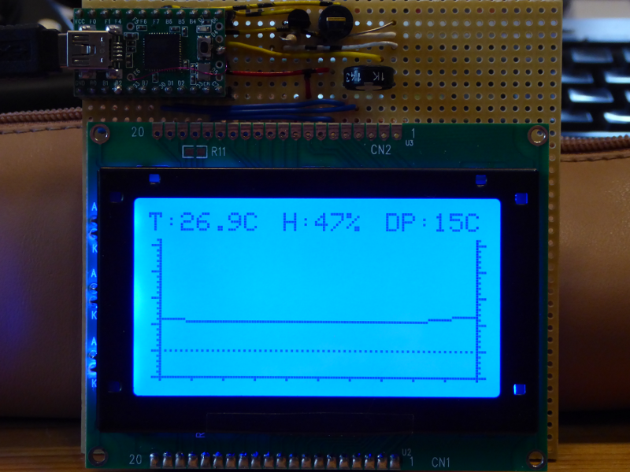

# Arduino library for NT7534 in parallel mode

## Some infos

### Recycling displays

We got 24 new graphic displays from the Recycling Center. The displays are from GEM-TECH and are labelled with GTK-281.

The displays has 128x64 pixel, works with 3.3V on the data pins and 5V for the internal [NT7534](http://www.densitron.com/uploadedFiles/Displays/Support/NT7534.pdf "NT7534") (or NT7538) chip and the background LEDs. There are 8 data pins (works in parallel mode (P/S on 3.3V)). The pin chip pin C86 is on 3.3V so we have an 6800 processor bus with A0 (D/I) Enable and R/W inside.

The library was tested with Teensy 2.0 (Leonardo) and an ESP32. Strangely it does not work with the RPI Pico2040. 

There exists also an I2C version with a port extender IC:

<https://www.weigu.lu/microcontroller/ardlib_NT7534_I2C/index.html>

## All infos: <http://www.weigu.lu/microcontroller/ardlib_NT7534/index.html>
